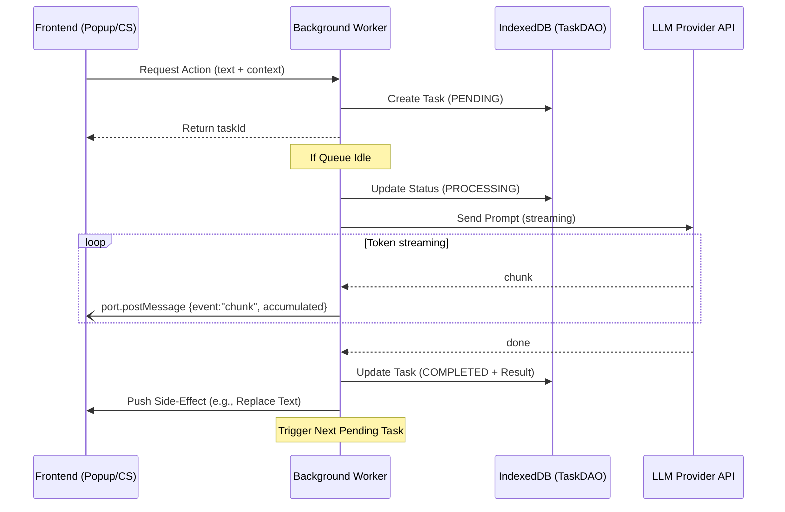
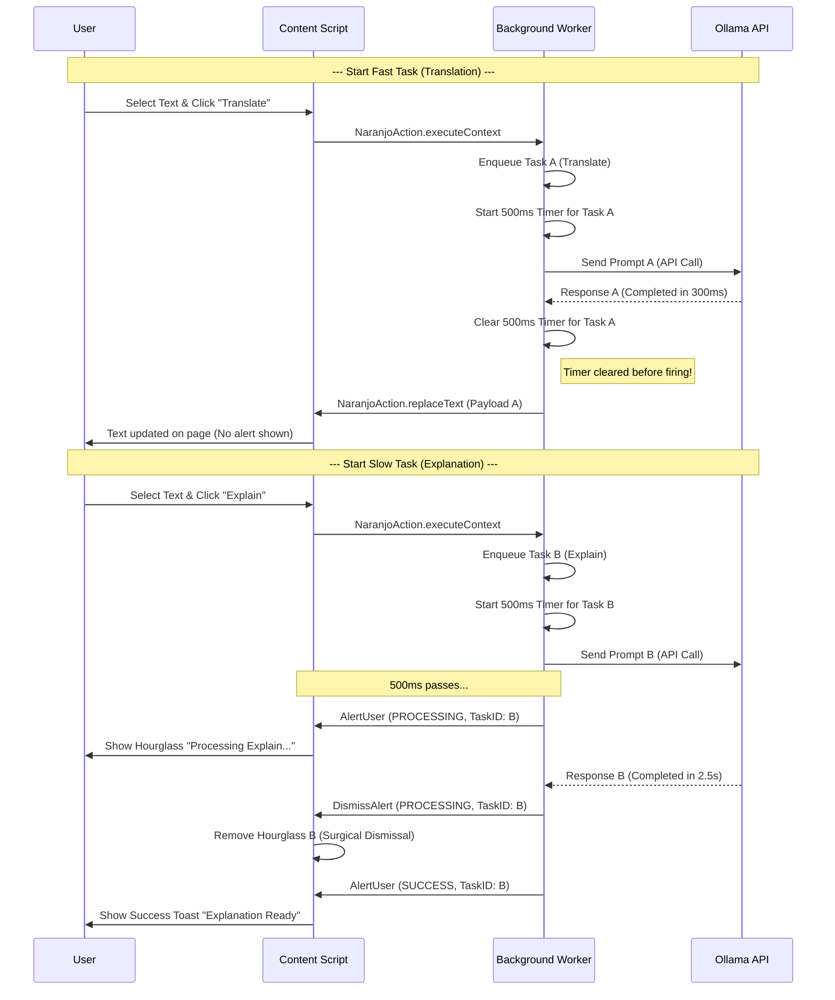

# Communication Flow in Naranjo

This document outlines how the different components of the Naranjo browser extension communicate with each other, including the **Task Queue** system for long-running LLM operations.

## Overview

Naranjo uses the `webextension-polyfill` library for cross-browser compatibility. Communication happens between:
1.  **Frontend (Popup):** Configuration UI and Task History viewer.
2.  **Frontend (Options Page):** Per-provider configuration.
3.  **Frontend (Content Scripts):** Webpage DOM interaction, selection handling, quick menu overlay, toast notifications.
4.  **Background Worker:** The central orchestrator, Queue Manager, and multi-provider LLM client.

---

## Communication Patterns

### Pattern A: Direct Response (Request-Response)
Used for immediate data retrieval (e.g., getting the list of models).
1.  **Frontend:** `await browser.runtime.sendMessage({ action: "getSelectedModel" })`.
2.  **Worker:** Processes the request and **returns** the value directly.
3.  **Frontend:** Receives the value as the resolved Promise result.

### Pattern B: Queue-Based Execution (Long-running Tasks)
To prevent resource contention and provide history, all LLM actions (Translation, Summarization, etc.) follow a queued lifecycle.

#### 1. Task Creation (Enqueue)
- **Initiation:** User triggers an action (Context Menu, Keyboard Shortcut, Quick Menu, or Custom Prompt).
- **Request:** The frontend sends a request to the worker to create a task.
- **Persistence:** The worker's **TaskDAO** saves the task to **IndexedDB** with status `PENDING`.
- **Response:** The worker returns a `taskId` immediately to the frontend.

#### 2. Queue Management (Serialization)
- **Global Lock:** The Background Worker maintains a global processing state. Only **one task** is executed at a time.
- **Trigger:** If the queue is idle, the worker starts the new task immediately. Otherwise, the task waits in IndexedDB.
- **Restart Safety:** On service worker startup, the queue resumes any `PENDING` tasks that survived the restart.

#### 3. Execution & Streaming
- **Processing:** The worker marks the task as `PROCESSING` and calls the configured LLM provider service.
- **Streaming:** The worker opens a long-lived port (`naranjo-stream-<taskId>`) to the originating tab and sends `chunk` messages as tokens arrive.
- **Persistence:** Once complete, the worker updates the IndexedDB entry with the `output` and sets status to `COMPLETED`.
- **Side-Effect (Push):** The worker sends a final message to the Content Script (e.g., `NaranjoAction.replaceText`) to apply the result.
- **Next Task:** Upon completion, the worker automatically checks IndexedDB for the next `PENDING` task.

#### 4. History & Cleanup
- **History View:** The Popup queries the TaskDAO to display a table of recent actions and their results.
- **Deletion:** The user can delete completed tasks from the history, which removes them from IndexedDB.

---

## Task Lifecycle Diagram



## Message Structure
Standard message structure defined in `src/entities/types.ts`:

```typescript
// All request messages from popup/content script → background
type APIMessages = GetSelectedModelAPIMessage | SetSelectedModelAPIMessage | ... // union of all request types

// All push messages from background → content script
type ResponseAPIMessage = ReplaceResponseAPIMessage | AlertResponseAPIMessage | ... // union of all response types

// Streaming messages over long-lived ports
type StreamPortMessage =
  | { event: "start"; taskId: string; action: NaranjoAction }
  | { event: "chunk"; accumulated: string }
  | { event: "done"; fullContent: string }
  | { event: "error"; message: string };

interface NaranjoTask {
  id: string;
  action: NaranjoAction;
  input: string;
  prompt: string;
  output?: string;
  status: TaskStatus; // "PENDING" | "PROCESSING" | "COMPLETED" | "FAILED"
  timestamp: number;
  tabId?: number;
  contextTitle: string;
  modelId?: string;  // "providerId:modelId" format
}
```


## Smart Feedback & Notification Lifecycle

To provide a responsive and non-intrusive user experience, Naranjo employs a "Smart Replacement" strategy for notifications. This ensures that fast tasks feel seamless while long-running operations provide clear, active feedback.

### Key Optimization Strategies:
1.  **500ms Threshold:** A "Processing" notification only appears if a task takes longer than 500ms. This avoids "flickering" for near-instant operations like simple translations.
2.  **Surgical Dismissal:** Every notification is tagged with a unique `taskId`. When a task finishes, it specifically removes its own hourglass icon without affecting other active notifications.
3.  **Visual Replacement:** When a task completes (Success or Error), the system automatically clears the corresponding "Processing" alert before showing the final result.
4.  **Sticky Success Toasts:** `SUCCESS` toasts remain visible until explicitly dismissed by the user (not auto-removed on tab visibility changes).

### Notification Flow Diagram


