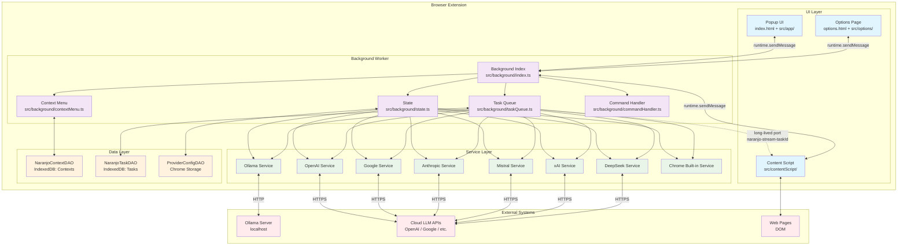
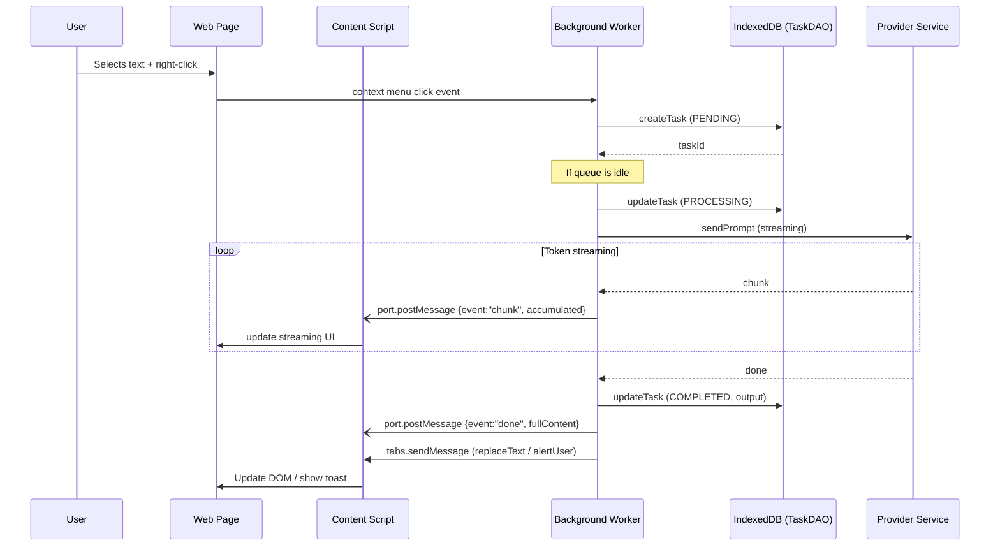
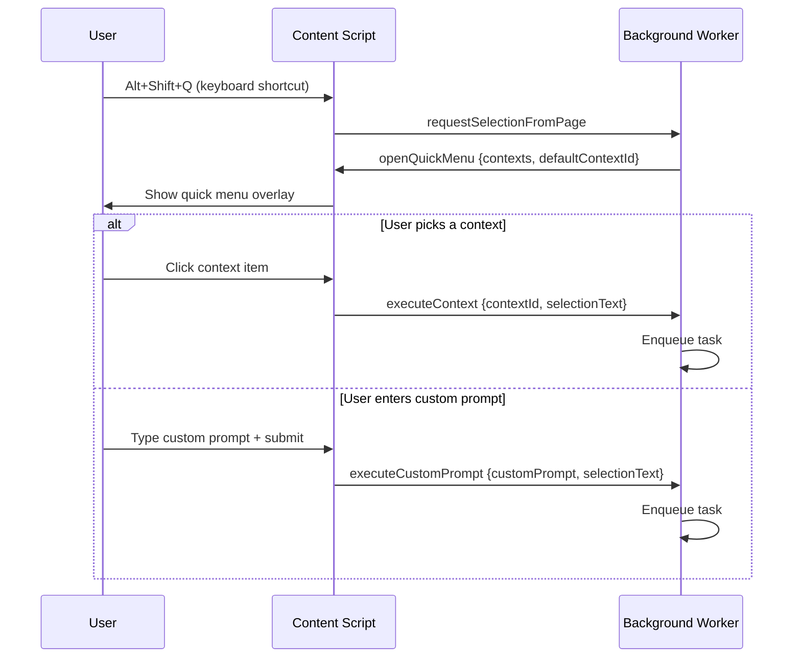
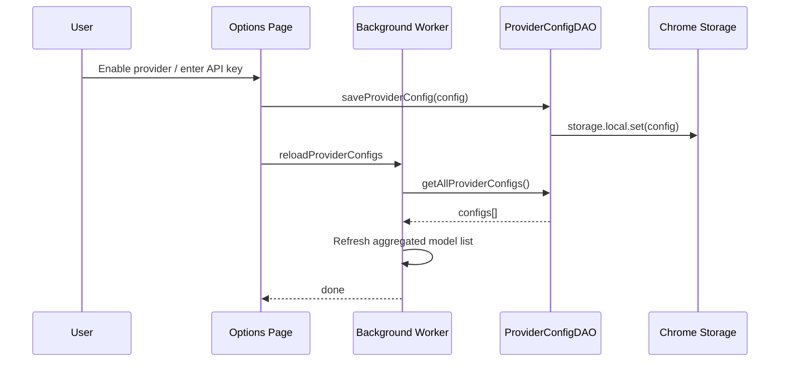
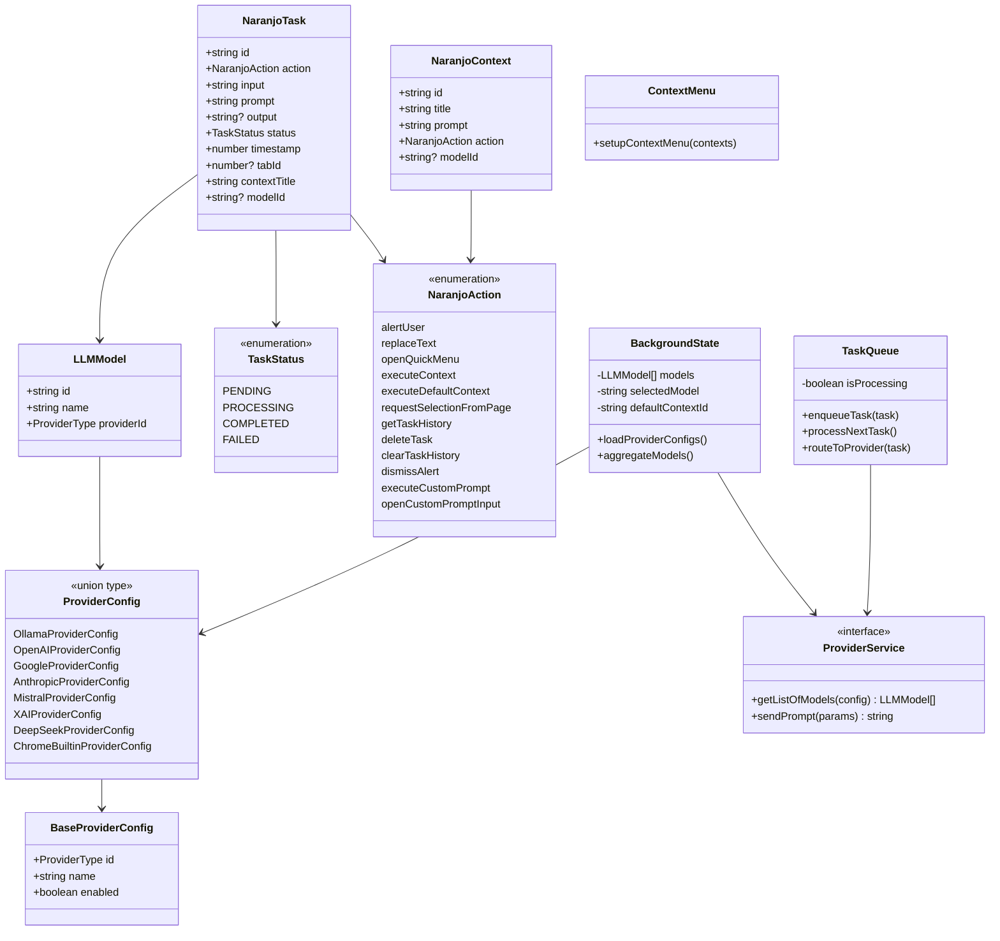
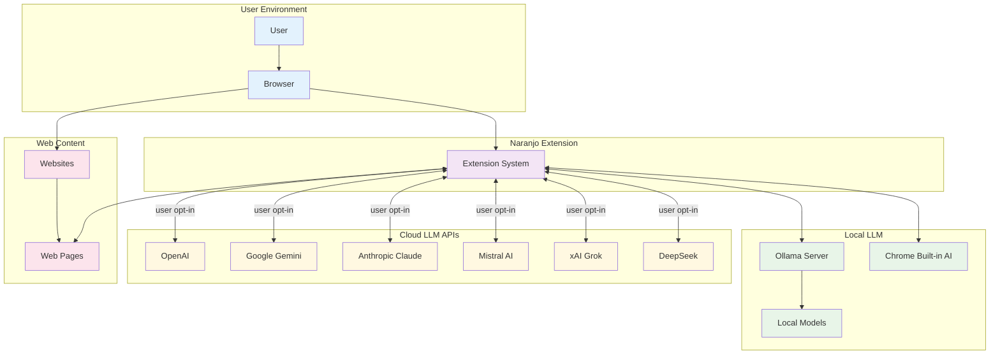
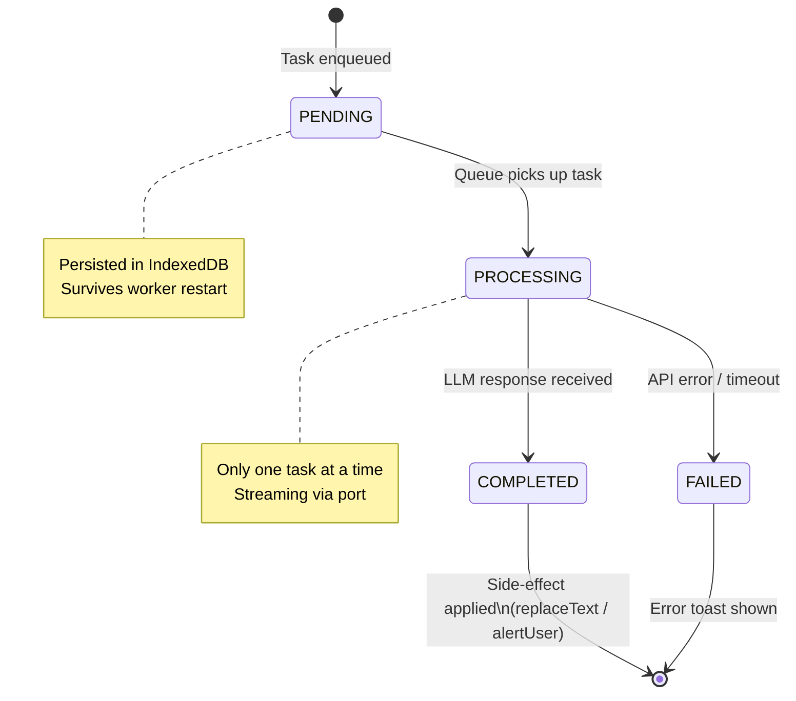
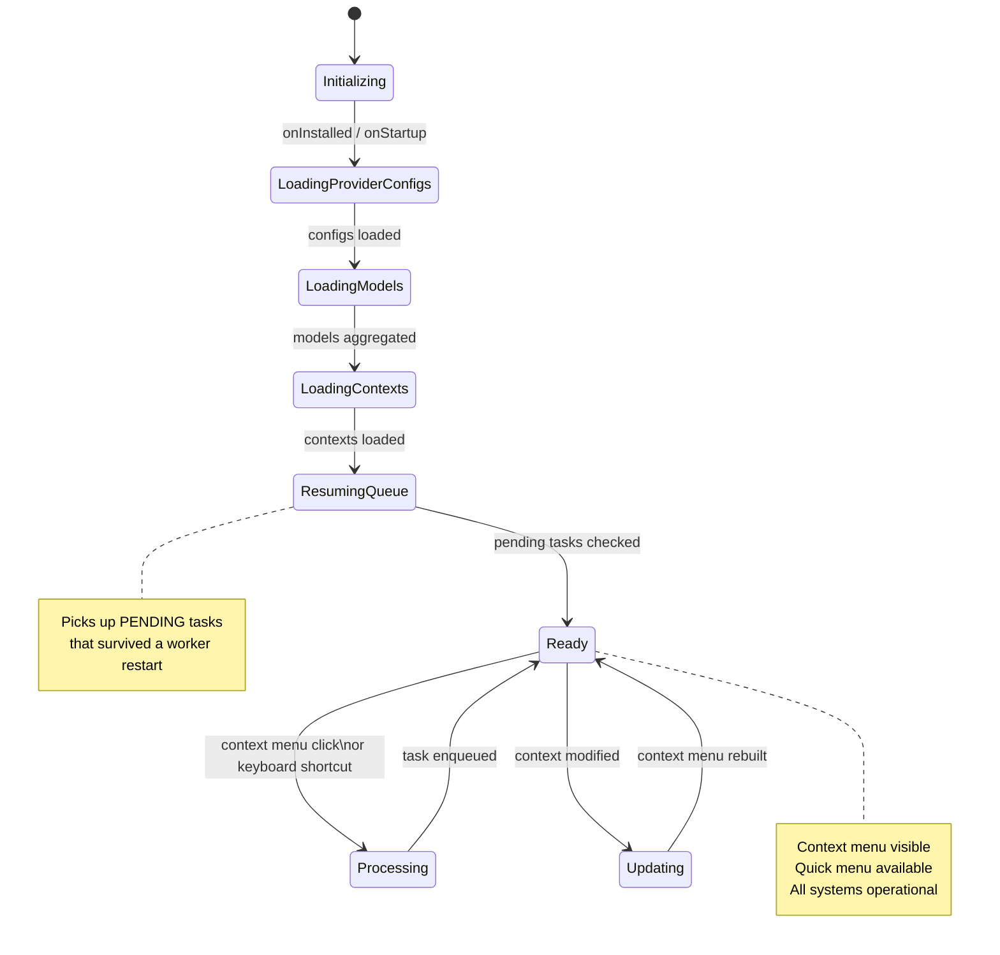
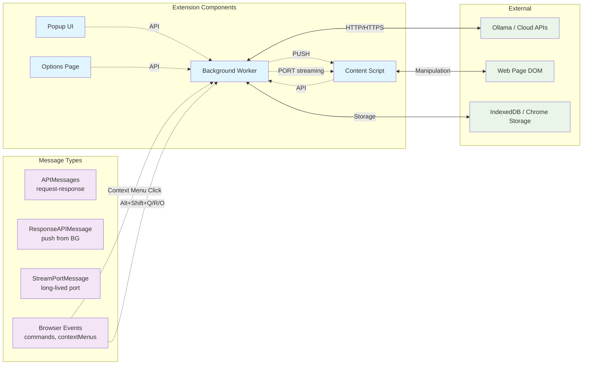

# System Diagrams

## Component Architecture Diagram

## Data Flow Diagram - Context Menu Interaction

## Data Flow Diagram - Quick Menu Flow

## Data Flow Diagram - Configuration Management

## Class Diagram

## System Context Diagram

## State Machine - Task Lifecycle

## State Machine - Extension Initialization

## Component Communication Flow

